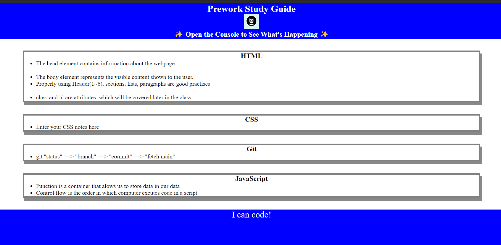

# Prework project outline

## Description

- To get head start of the UofT coding bootCamp by completing the prework project.
- Get myself familiar with the basics of coding skills.
- To be familiar with HTML, CSS, JavaScript, git/github, README and finally deployment.
- I am now familiar with those basic concepts.

## Installation

N/A

## Usage

Just simply click to open the webpage.

To add a screenshot, create an `assets/images` folder in your repository and upload your screenshot to it. Then, using the relative file path, add it to your README using the following syntax:

## Credits

I mostly followed tutorials. Here is the [link](https://docs.github.com/en/get-started/writing-on-github/getting-started-with-writing-and-formatting-on-github/basic-writing-and-formatting-syntax)

## License
MIT License
